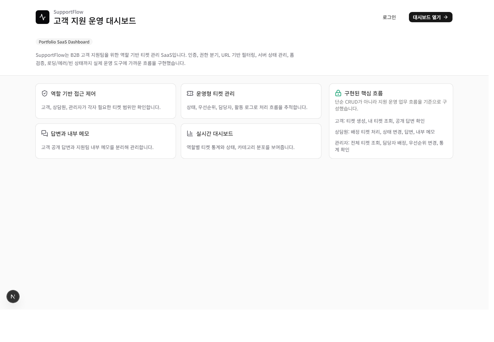
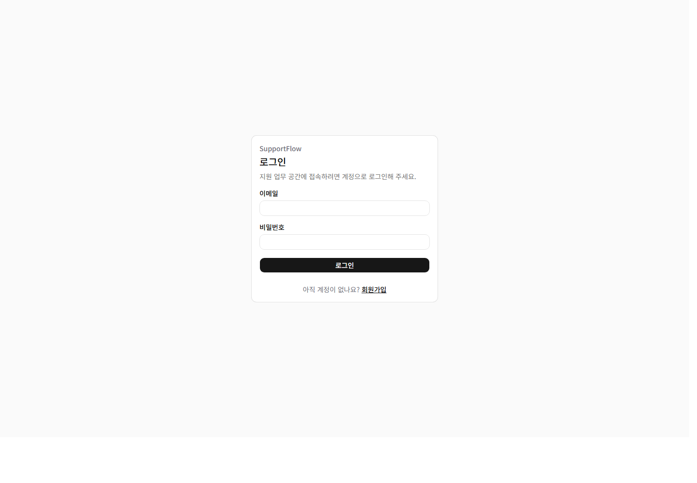

# SupportFlow

SupportFlow is a portfolio-grade B2B customer support ticket management SaaS built with Next.js, Supabase, TanStack Query, React Hook Form, and Zod.

It is designed to look and behave like a practical support operations dashboard rather than a simple CRUD board. The app covers authenticated workflows, role-based access control, ticket filtering, detail operations, customer-visible replies, internal notes, activity logs, and dashboard statistics.

## Problem

Support teams need a reliable place to receive customer issues, route them to agents, track priority, and keep an audit trail of operational changes. A basic inquiry board usually stops at creating and listing messages. SupportFlow models the workflow more realistically:

- Customers create tickets and see only their own requests.
- Agents work from assigned tickets, reply to customers, update status, and add internal notes.
- Admins see all tickets, assign agents, change priority, and monitor operational statistics.

## Why This Project Is Realistic

SupportFlow demonstrates the front-end patterns expected in an internal SaaS dashboard:

- Authenticated App Router pages
- Role-aware routing and data access
- URL-based search, filter, sort, and pagination
- Server state handled with TanStack Query
- Form validation with React Hook Form and Zod
- Loading, error, empty, unauthorized, and not-found states
- Activity logs for traceability
- Feature-based architecture for maintainability
- Mobile-friendly ticket list layout

## Tech Stack

| Technology | Why it is used |
| --- | --- |
| Next.js | App Router, protected pages, server components, and production deployment flow |
| TypeScript | Type-safe domain models, API responses, forms, and component props |
| Tailwind CSS | Fast, consistent dashboard styling |
| shadcn/ui / Base UI | Accessible buttons, cards, tables, inputs, badges, and skeletons |
| Supabase | Auth, Postgres database, row-level security, and application data |
| TanStack Query | Server state caching, loading/error states, invalidation, and optimistic updates |
| React Hook Form | Performant form state management |
| Zod | Runtime validation and inferred TypeScript types |
| Vercel | Intended deployment target |

## Main Features

- Email/password signup and login with Supabase Auth
- Protected routes and authenticated redirects
- Role model: `customer`, `agent`, `admin`
- Customer-only ticket creation
- Role-scoped ticket list
- URL query based search, filters, sort, and pagination
- Ticket detail page with metadata, replies, internal notes, and logs
- Status changes for agents and admins
- Priority changes and agent assignment for admins
- Customer-visible replies and internal support notes
- Activity logs for ticket operations
- Dashboard statistics by role-scoped ticket access
- Table skeletons, detail skeletons, empty states, error states, unauthorized page, 404 page

## Role-Based Access Control

SupportFlow enforces roles in both UI flow and Supabase row-level security.

| Role | Access |
| --- | --- |
| Customer | Create tickets, view only own tickets, view public replies |
| Agent | View assigned tickets, reply, change status, add internal notes, view assigned-ticket dashboard |
| Admin | View all tickets, assign agents, change priority/status, view operational dashboard statistics |

The client receives the current profile and passes role context to feature hooks. Supabase RLS policies also restrict access at the database layer.

Customer accounts are intentionally routed to `/tickets` instead of `/dashboard`. In a real support product, customers usually need a focused "my inquiries" area, while dashboards are operational tools for agents and admins.

## URL-Based Filtering

Ticket list state is stored in query parameters where possible. This makes filtered views shareable and refresh-safe.

Example:

```txt
/tickets?status=open&priority=high&category=technical&sort=updated_desc&page=2
```

Implemented controls:

- Search by title
- Status filter
- Priority filter
- Category filter
- Sort order
- Pagination

## TanStack Query Usage

Server state is handled through feature hooks:

- `useTickets`
- `useTicket`
- `useCreateTicket`
- `useUpdateTicketAction`
- `useCreateTicketReply`
- `useDashboardStats`

Mutations invalidate ticket, ticket list, and dashboard queries after changes. Ticket action updates use optimistic UI updates with rollback on failure.

## Forms and Validation

Forms use React Hook Form with Zod schemas:

- Login form
- Signup form
- Ticket creation form
- Reply form
- Internal note form

Submit buttons are disabled while pending, and validation messages are shown next to the relevant field.

Customers do not set operational priority when creating a ticket. New tickets use the database default priority and admins can adjust priority after triage.

## Loading, Error, Empty, and Unauthorized States

SupportFlow includes:

- Ticket table skeleton
- Ticket detail skeleton
- Dashboard skeleton
- Form pending states
- Error messages for query failures
- Empty states for no tickets and no dashboard data
- Unauthorized page
- Not found page
- Global loading and error pages

## Screenshots

Screenshots are stored in `docs/screenshots`.

### Home



### Login



| Screen | File |
| --- | --- |
| Home | `docs/screenshots/home.png` |
| Login | `docs/screenshots/login.png` |

Dashboard and authenticated ticket screenshots should be captured after seed users are available in the deployed environment.

## Folder Structure

```txt
src/
  app/
    login/
    signup/
    dashboard/
    tickets/
      page.tsx
      new/
      [id]/
    admin/
    unauthorized/

  components/
    common/
    ui/

  features/
    auth/
      api/
      components/
      schemas/
      types/
    dashboard/
      api/
      components/
      hooks/
    tickets/
      api/
      components/
      hooks/
      schemas/
      types/

  lib/
    supabase/
    env.ts
    query-client.ts
    utils.ts

  types/
    database.ts
    domain.ts
```

## Getting Started

Install dependencies:

```bash
npm install
```

Create `.env.local`:

```bash
NEXT_PUBLIC_SUPABASE_URL=
NEXT_PUBLIC_SUPABASE_ANON_KEY=
```

Run the development server:

```bash
npm.cmd run dev
```

Open:

```txt
http://localhost:3000
```

## Supabase Setup

Run the schema in Supabase SQL Editor:

```txt
docs/SUPABASE_SCHEMA.sql
```

The schema includes:

- `profiles`
- `tickets`
- `ticket_replies`
- `ticket_logs`
- enum types for roles, status, and priority
- RLS policies for customers, agents, and admins
- trigger helpers for profile creation and ticket timestamps

## Demo Accounts

Create these users in Supabase Auth, then set their `profiles.role` values in the `profiles` table.

| Role | Email | Password |
| --- | --- | --- |
| Customer | `customer@supportflow.dev` | `Password123!` |
| Agent | `agent@supportflow.dev` | `Password123!` |
| Admin | `admin@supportflow.dev` | `Password123!` |

Recommended role updates:

```sql
update public.profiles set role = 'customer' where email = 'customer@supportflow.dev';
update public.profiles set role = 'agent' where email = 'agent@supportflow.dev';
update public.profiles set role = 'admin' where email = 'admin@supportflow.dev';
```

## Useful Scripts

```bash
npm.cmd run dev
npm.cmd run lint
npm.cmd run build
```

## Troubleshooting

| Problem | Fix |
| --- | --- |
| Supabase request fails | Check `.env.local`, restart the dev server, and verify RLS policies |
| Signup succeeds but role is wrong | Update `profiles.role` in Supabase |
| Agent sees no tickets | Assign tickets to the agent through an admin account |
| Admin cannot assign agents | Verify admin profile role and profile select policy |
| `npm` is blocked in PowerShell | Use `npm.cmd run dev`, `npm.cmd run lint`, or `npm.cmd run build` |

## Deployment

Target platform: Vercel

```txt
Deployment URL: TBD
```

Add these environment variables in Vercel:

```txt
NEXT_PUBLIC_SUPABASE_URL
NEXT_PUBLIC_SUPABASE_ANON_KEY
```

## Status

Completed phases:

- Project setup
- Supabase setup
- Authentication
- Role-based access
- Ticket creation
- Ticket list
- Ticket detail
- Ticket actions
- Replies and internal notes
- Dashboard statistics
- Polish
- Portfolio documentation
